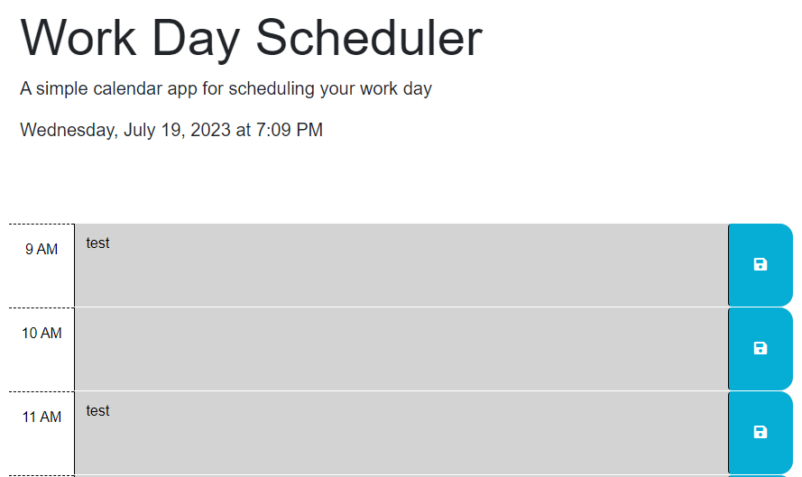

# daily-scheduler

## Description

This project is a daily scheduler created utilizing day.js to retrive current time.  The scheduler uses different colors to display urgency of daily tasks.

## Installation

Run the index.html file in a browser window or go to the github pages link here: <a href="https://max24p7.github.io/daily-scheduler/">Daily Scheduler</a>

## Usage

Using the scheduler is simple.  Begin by building out your schedule for the day by typing out tasks in each time block. You will have to click save on each individual time block in order to save what has been written.  As your day progresses, the time blocks will change in color indicating urgency of task completion. (Grey = Past tasks -- Green = Future tasks -- Red = Current tasks). 

## Credits

https://developer.mozilla.org/en-US/docs/Web/JavaScript/Reference/Global_Objects/Date/toLocaleDateString

https://www.youtube.com/watch?v=vzGzys3enCE&t=4s

https://developer.mozilla.org/en-US/docs/Web/JavaScript/Reference/Global_Objects/parseInt

https://developer.mozilla.org/en-US/docs/Web/JavaScript/Reference/Operators/this